Welcome to **LeRobotDepot**. This repository lists open-source hardware, components, 3D-printable projects, and related robots for the [LeRobot library](https://github.com/huggingface/lerobot) community. It helps users discover, build, and contribute to affordable, accessible robotics solutions powered by state-of-the-art AI.

## Start here

- **Building your first arm?** Start with the [SO-100 / SO-101](#catalog-so-arm100), then [compare robot arms](#robot-arms).
- **Want a robot that moves?** Browse [mobile manipulators](#mobile-manipulators), including single- and dual-arm designs.
- **Need two arms or a legged robot?** Jump to [dual-arm robots](#dual-arm-robots) or [legged and humanoid robots](#legged-and-humanoid-robots).
- **Upgrading a build?** Browse [grippers](#grippers), [linear axes and tools](#linear-axes-and-tools), or [vision and teleoperation](#vision-and-teleoperation).
- **Already know your motors?** Use the [motor guide](#motor-guide), then check the motor family in the [catalog index](#catalog-index).

## Browse by robot type

- [Robot arms](#robot-arms)
- [Dual-arm robots](#dual-arm-robots)
- [Mobile manipulators](#mobile-manipulators)
- [Legged and humanoid robots](#legged-and-humanoid-robots)
- [Grippers](#grippers)
- [Linear axes and tools](#linear-axes-and-tools)
- [Task objects and grip materials](#task-objects-and-grip-materials)
- [Vision and teleoperation](#vision-and-teleoperation)
- [Motor guide](#motor-guide) · [Contributing](#contributing)

## Catalog index

Select a project or its picture to jump to the detailed entry below. Prices are estimates already listed in this catalog; **their scope differs** (one arm, a pair, parts, or a complete build). Check each project for current prices, shipping, and availability.

### Robot platforms

| Preview | Project | Type | Motors | Listed price / scope |
| --- | --- | --- | --- | --- |
|  | [SO-100 & SO-101 Arms](#catalog-so-arm100) | Robot arm | Feetech | $122, one arm |
|  | [Robonine SO-ARM 102](#catalog-so-arm102) | Robot arm | Feetech | ≈$629, leader + follower components; ≈$684 with printing material |
|  | [jess-moss/moss-robot-arms](#catalog-moss-robot-arm) | Robot arm | Feetech | $159, one arm |
|  | [ajinkyagorad/SO-ARM107](#catalog-so-arm107) | Robot arm | Feetech | Not listed (SO-100 + servo) |
| <a href="#catalog-so101-6dof">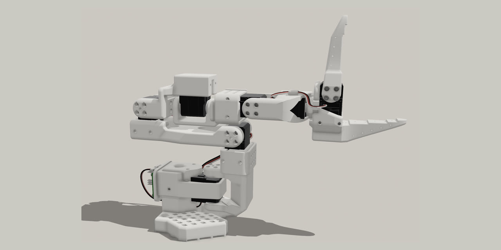</a> | [SO-101 6-DoF variant](#catalog-so101-6dof) | Robot arm variant | Feetech | Not listed |
| <a href="#catalog-so101-extended">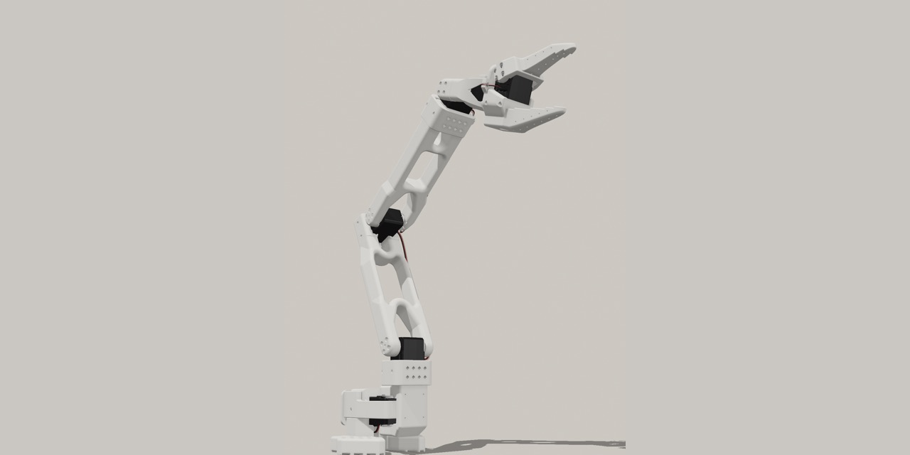</a> | [SO-101 extended arm](#catalog-so101-extended) | Robot arm variant | Feetech | Not listed |
| <a href="#catalog-el-robot">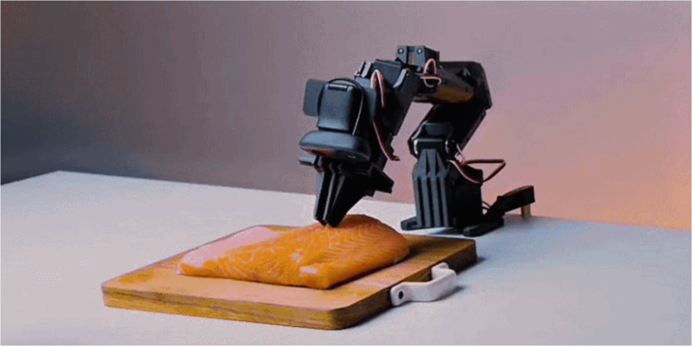</a> | [norma-core/ElRobot](#catalog-el-robot) | Robot arm | Feetech | ±$220, follower |
|  | [SAM arm](#catalog-sam-arm) | Robot arm | Feetech | ±$450, pair |
| <a href="#catalog-pingti-arm">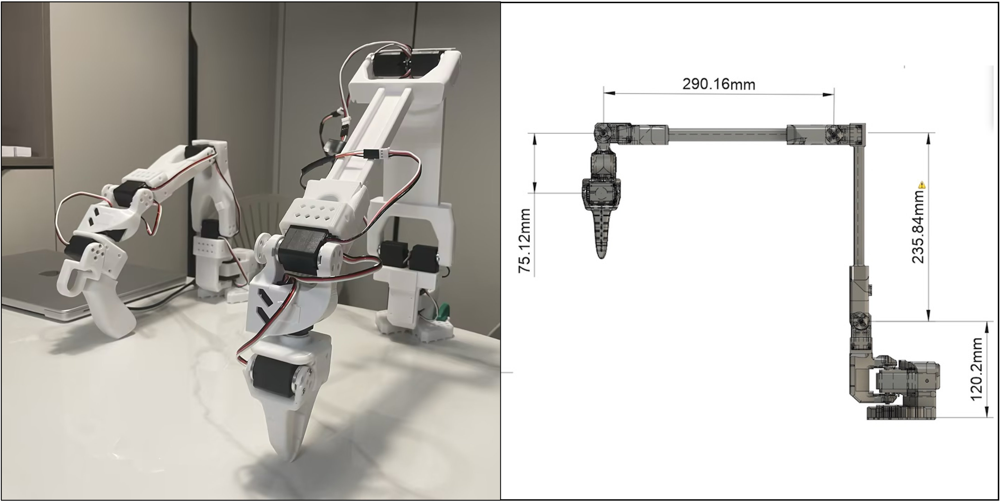</a> | [nomorewzx/PingTi-Arm](#catalog-pingti-arm) | Robot arm | Feetech | ±$261, follower |
| <a href="#catalog-am-arm200">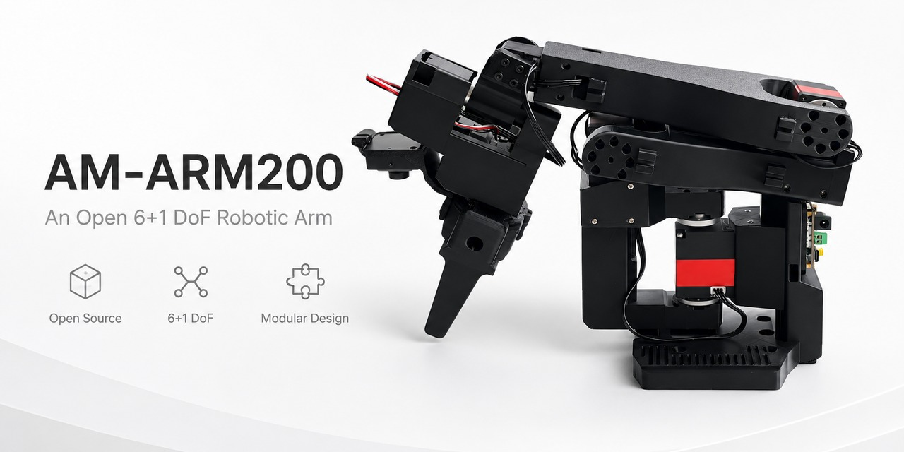</a> | [liyiteng/AM-ARM200](#catalog-am-arm200) | Robot arm (project LeRobot fork) | Feetech STS3215 + STS3095 | ≈$243 follower / ≈$144 leader, priced parts |
|  | [jess-moss/koch-v1-1](#catalog-koch-v1-1) | Robot arm | Dynamixel | $199, follower |
| <a href="#catalog-omx">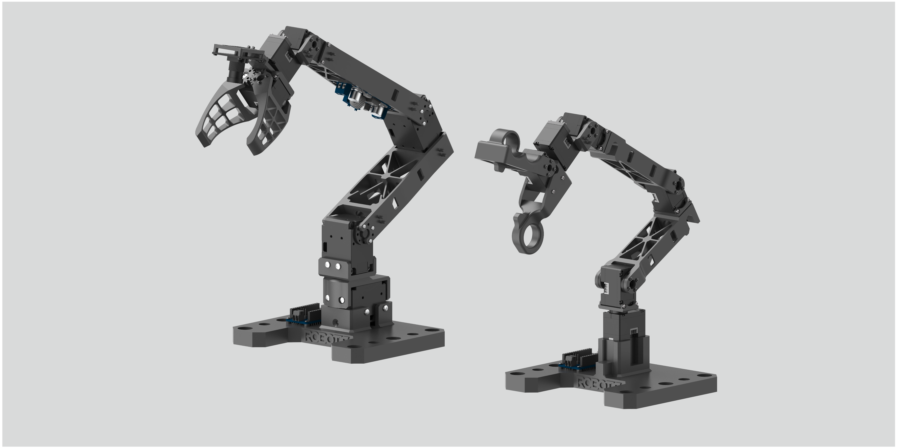</a> | [robotis/omx](#catalog-omx) | Robot arm | Dynamixel | $250, leader/follower kits |
| <a href="#catalog-nextis-aira-3d">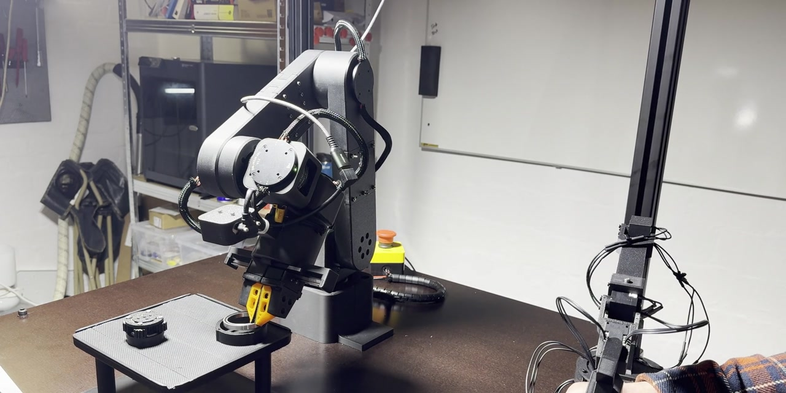</a> | [robertorobotics/Nextis-AIRA-3D](#catalog-nextis-aira-3d) | Robot arm | Damiao + Dynamixel | ≈$1,650, follower parts |
| <a href="#catalog-openarm">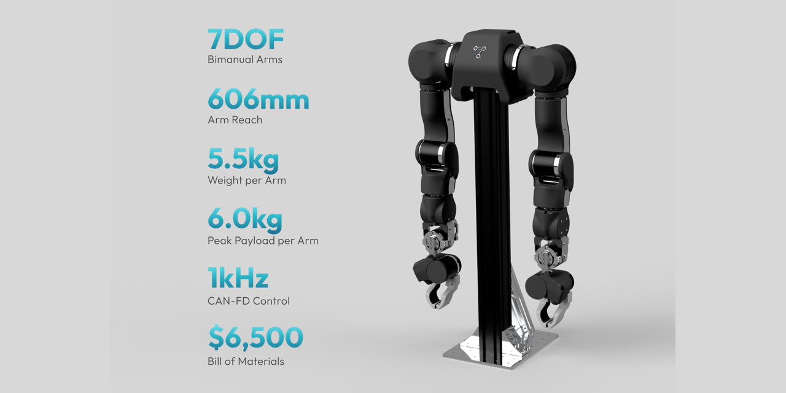</a> | [Enactic OpenArm 2.0](#catalog-openarm) | Dual-arm | Damiao | ≈$6,500, bimanual system |
| <a href="#catalog-ab-so-bot">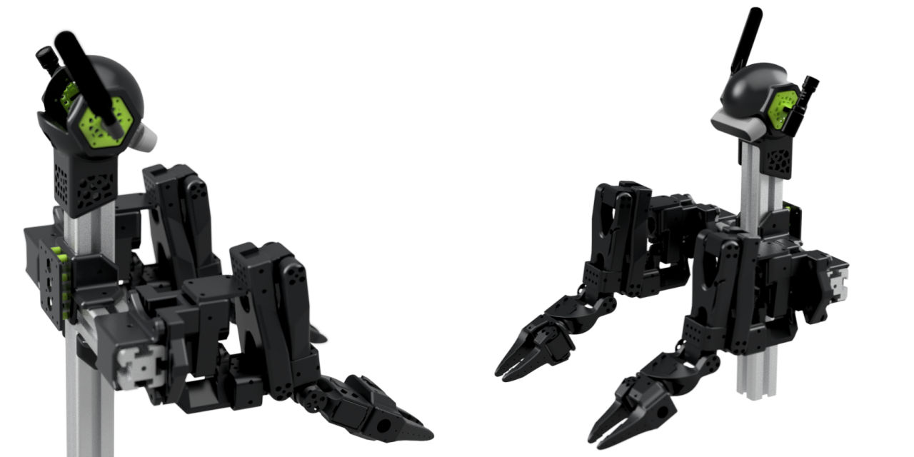</a> | [Mr-C4T/AB-SO-BOT](#catalog-ab-so-bot) | Dual-arm | Feetech | Not listed |
| <a href="#catalog-dual-scorpion">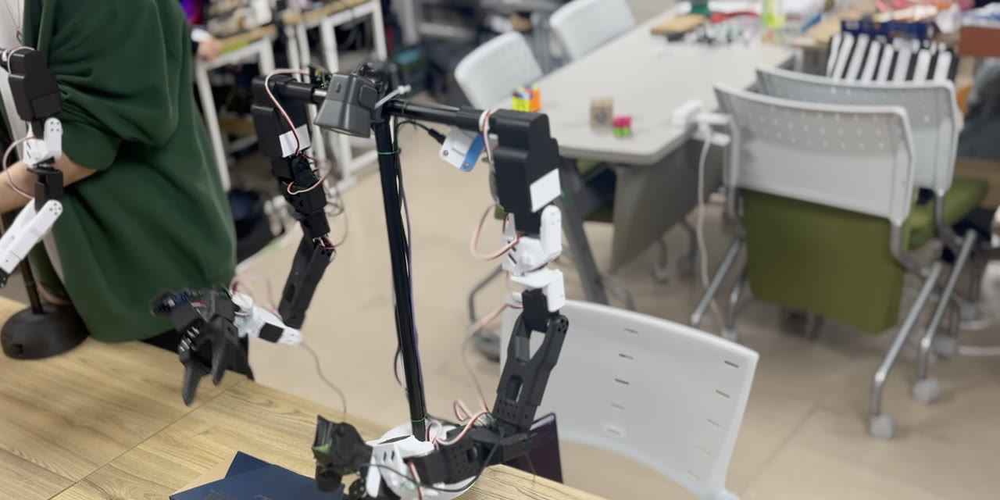</a> | [Dual Scorpion](#catalog-dual-scorpion) | Dual-arm | Feetech | ≈$637, leader + follower (cameras excluded) |
|  | [ALOHA 2](#catalog-aloha-2) | Dual-arm | Dynamixel | ≈$27,000, listed estimate |
|  | [LeKiwi (Feetech)](#catalog-lekiwi) | Mobile arm | Feetech | $488.21, 12V version |
|  | [LeKiwi (Dynamixel)](#catalog-dynamixellekiwi) | Mobile arm | Dynamixel | Not listed |
| <a href="#catalog-alohamini">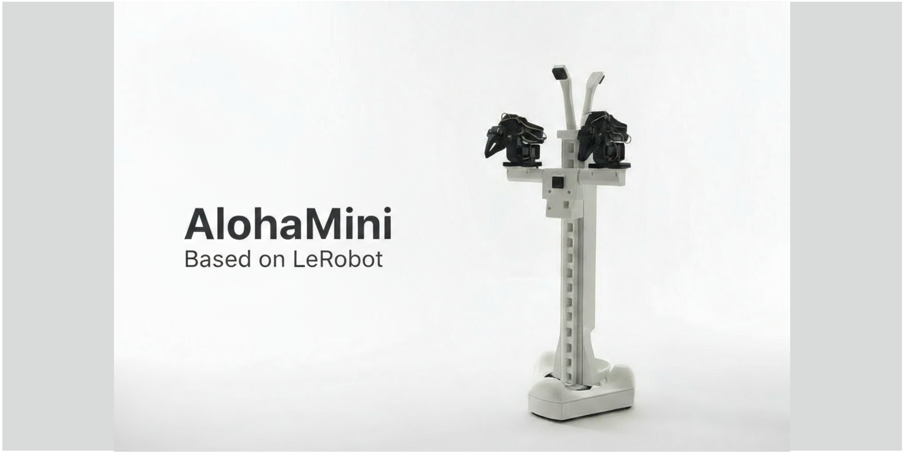</a> | [liyiteng/AlohaMini](#catalog-alohamini) | Mobile dual-arm | Feetech | ≈$600, total |
| <a href="#catalog-xlerobot">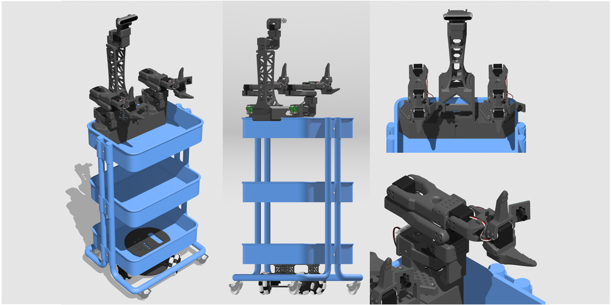</a> | [Vector-Wangel/XLeRobot](#catalog-xlerobot) | Mobile dual-arm | Feetech | ≈$660, basic build |
|  | [timqian/bambot](#catalog-bambot) | Mobile dual-arm | Feetech | ≈$300, total |
|  | [apirrone/Open_Duck_Mini](#catalog-open-duck-mini) | Biped (LeRobot adapter needed) | Feetech family | ≈€410 |
| <a href="#catalog-microduck">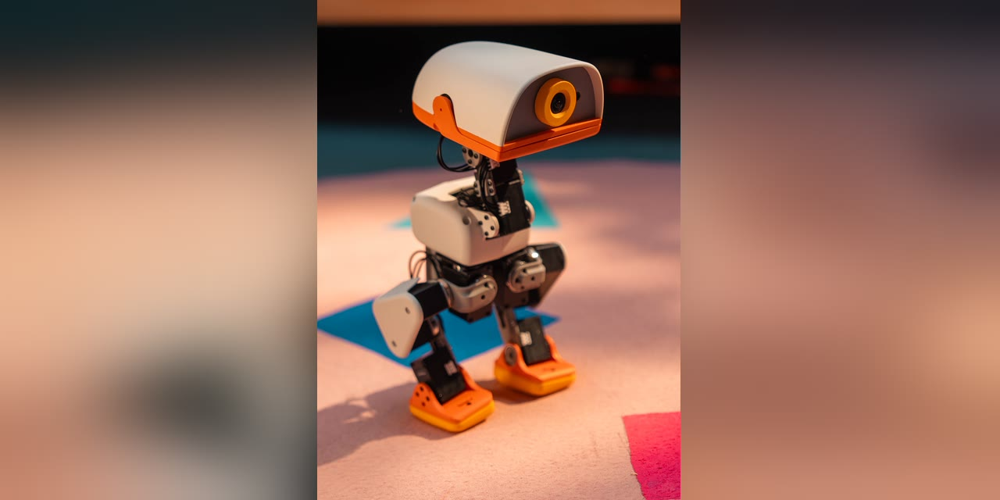</a> | [Pollen Robotics Microduck](#catalog-microduck) | Biped (LeRobot support planned) | 15 motors | $399, complete robot (introductory pre-order) |
|  | [TheRobotStudio/HOPEJr](#catalog-hopejr) | Humanoid | Feetech family | Not listed |

### Add-ons and tools

**SO-10X** refers to the SO-100/SO-101 family. Where a project names only one model, the table keeps that specific model; the family label does not guarantee identical mounting on both.

| Preview | Project | What it adds | Fits / use | Listed price / scope |
| --- | --- | --- | --- | --- |
| <a href="#catalog-grip4so101">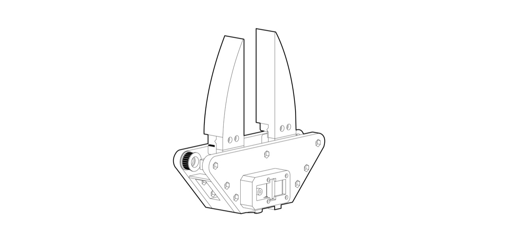</a> | [Grip4SO101](#catalog-grip4so101) | Modular gripper | SO-101 | ≈$90–$100, gripper hardware estimate |
|  | [pollen-robotics/PincOpen](#catalog-pincopen) | Gripper | SO-100 | ≈€25, gripper |
| <a href="#catalog-so-arm-symmetrical-gripper">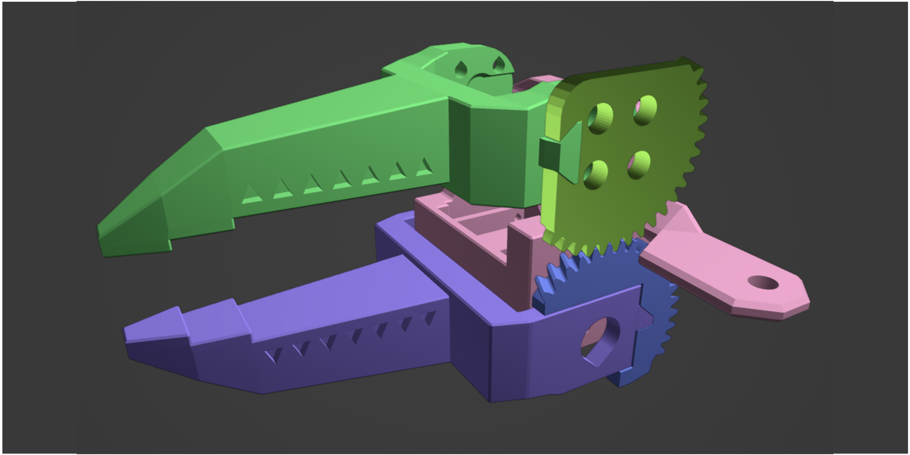</a> | [SiegeLord/Symmetrical Gripper](#catalog-so-arm-symmetrical-gripper) | Gripper | SO-10X family | Not listed |
|  | [Chojins/LeRobot-S0-100-Models](#catalog-so-100-chojins-gripper) | Gripper | SO-100 | Not listed |
| <a href="#catalog-parallel-gripper-1">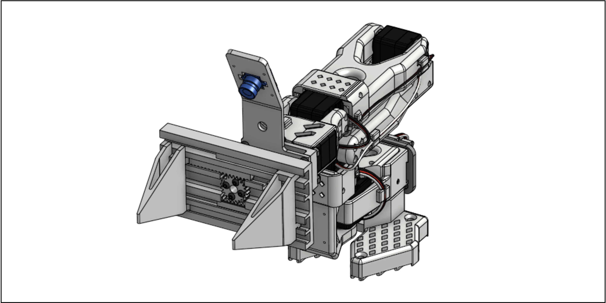</a> | [ggao50/SO101-Parallel-Gripper](#catalog-parallel-gripper-1) | Gripper + camera holder | SO-101 | Not listed |
|  | [norma-core/pgripper](#catalog-norma-core-pgripper) | Gripper + camera holder | ElRobot; SO-10X may fit | Not listed |
| <a href="#catalog-compliant-gripper-1">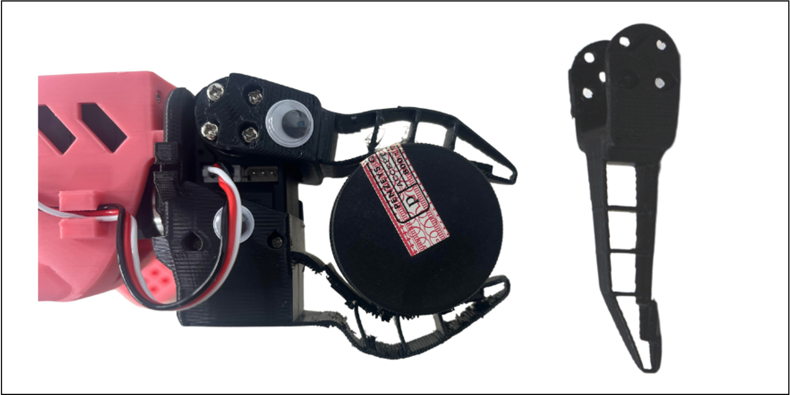</a> | [SO-ARM Compliant Gripper](#catalog-compliant-gripper-1) | Flexible gripper | SO-101 | Not listed |
|  | [XLeRobot Compliant Gripper](#catalog-compliant-gripper-2) | Flexible gripper | XLeRobot | Not listed |
| <a href="#catalog-so-arm-parallel-gripper-robonine">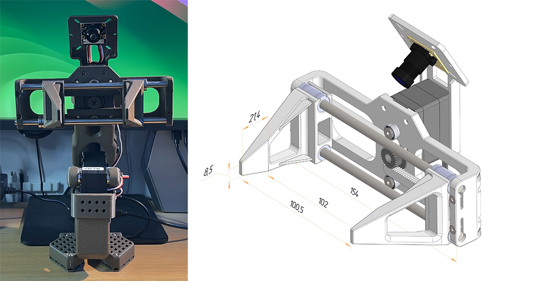</a> | [roboninecom/SO-ARM100-101-Parallel-Gripper](#catalog-so-arm-parallel-gripper-robonine) | Parallel gripper | SO-10X | ≈$62, gripper BOM; ≈$83 full packs |
| <a href="#catalog-leflexitac">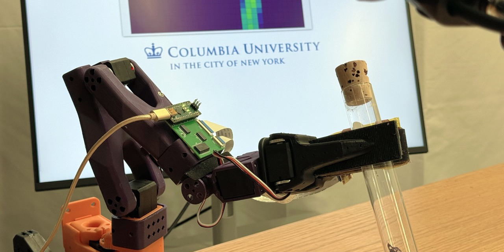</a> | [TNA001-AI/lerobot_tactile](#catalog-leflexitac) | Tactile gripper | SO-10X | ≈$44, tactile add-on |
|  | [avenhaus/SO-ARM100-Track-Axis](#catalog-track-axis) | Linear axis | SO-100 | Not listed |
| <a href="#catalog-leslider">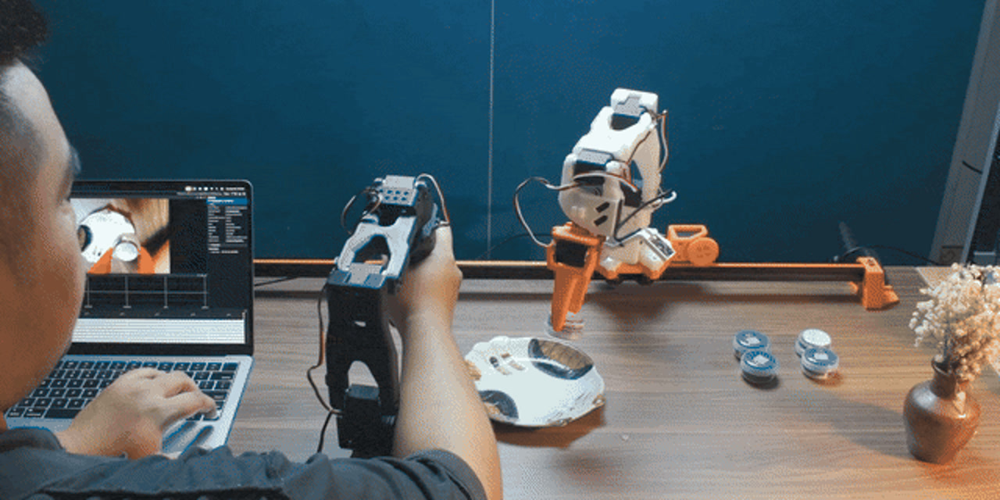</a> | [pham-tuan-binh/leslider](#catalog-leslider) | Linear axis | SO-101 | ≈$40, main slider hardware |
|  | [jackvial/assembler0](#catalog-so-arm-screwdriver) | Screwdriver + camera mount | SO-101 | Not listed |
|  | [jackvial/koch_robotic_arm_screwdriver](#catalog-koch-screwdriver-camera-mount) | Screwdriver + camera mount | Koch arm | Not listed |
| <a href="#catalog-open-arms-mini">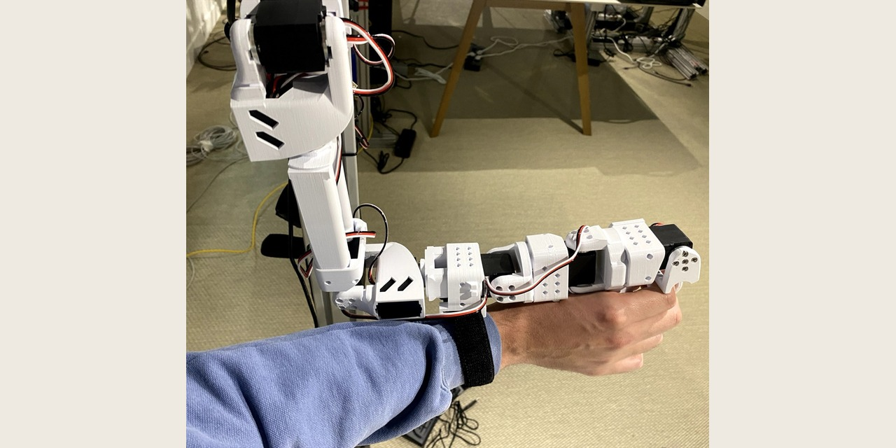</a> | [Open Arms Mini](#catalog-open-arms-mini) | 7-DOF leader arm + gripper | OpenArm teleoperation; Feetech STS3215 |
| <a href="#catalog-cambot">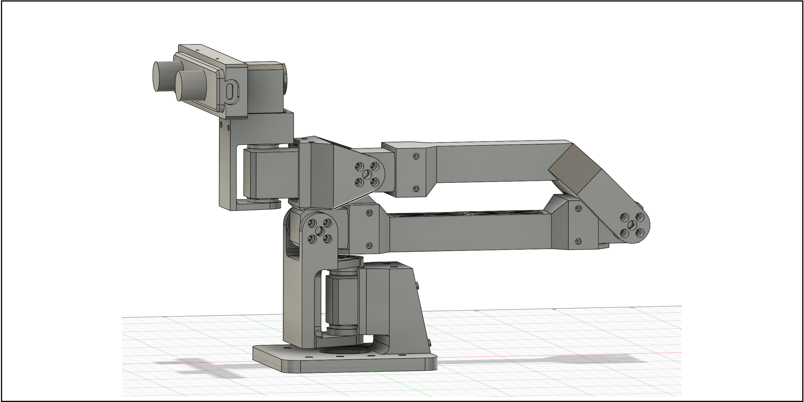</a> | [open-thought/cambot](#catalog-cambot) | Stereo camera arm | ZED Mini camera | ≈€110, camera excluded |
| <a href="#catalog-encoder-leader-arm">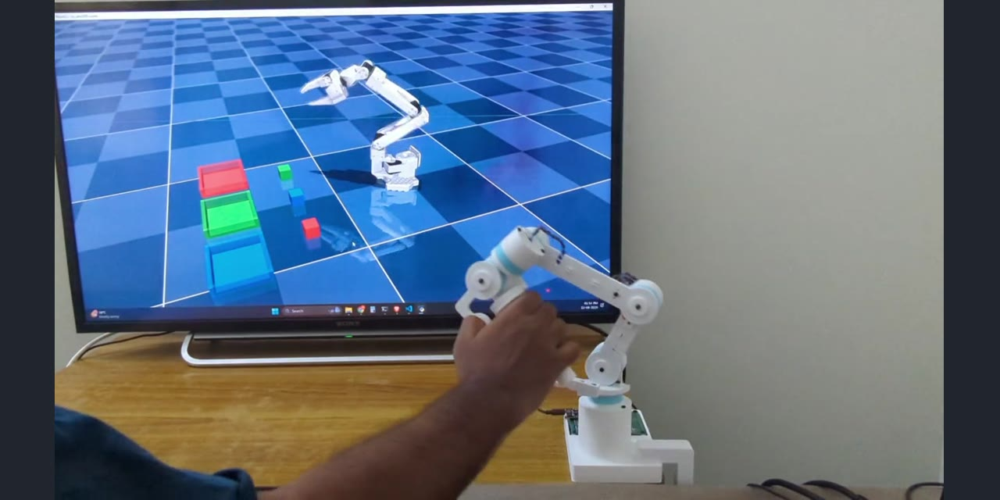</a> | [Matheshwaranpitchai/open-source-leader-arm](#catalog-encoder-leader-arm) | Encoder-based leader arm | SO-10X | ₹2,619 (≈$27), listed hardware; printing excluded |
|  | [max-titov/finger-tracker](#catalog-finger-tracker) | Hand tracking | HOPEJr hands | Not listed |
|  | [cgreer/robot-task-kit](#catalog-task-kit) | Manipulation task objects | Robot arm practice | Not listed |
|  | [Hugging Face rectangular prism](#catalog-huggingface-rectangular-prism) | Manipulation task object | Robot arm practice | Not listed |
|  | [Self-Fusing Silicone Rubber](#catalog-silicone-rubber) | Gripper friction material | Gripper tips | Not listed |
|  | [Foam Tape](#catalog-foam-tape) | Gripper friction material | Gripper tips | Not listed |

## Robot arms

### [SO-100 & SO-101 Arms](https://github.com/TheRobotStudio/SO-ARM100)

This **5 DOF arm** is the recommended arm to get started with LeRobot—especially the 7.4V version.

|             Price         | US    | EU    | RMB       |
|---------------------------|-------|-------|-----------|
| Follower and Leader arms  | $230  | €226  | ￥1343 |
| One Arm                   | $122  | €124  | ￥682  |

#### Accessories 

For detailed information on the various accessories available for the SO-ARM100, including mounting options and additional components, please refer to the [SO-ARM100 repository’s hardware documentation](https://github.com/TheRobotStudio/SO-ARM100?tab=readme-ov-file#hardware).

##### Wrist Cameras

The SO-ARM100 supports multiple wrist camera options to suit a variety of applications. There are three officially supported options and one community-developed alternative:

| Camera Name            |Reference Link                                                                                                 | Notes |
|------------------------|---------------------------------------------------------------------------------------------------------------|-------|
| [Vinmooog Webcam](https://amzn.eu/d/9nrIy5I)        |[SO-ARM100 Instructions](https://github.com/TheRobotStudio/SO-ARM100/tree/main/Optional/Wrist_Cam_Mount_Vinmooog_Webcam) | |
| 32x32mm UVC Module     |[SO-ARM100 Instructions](https://github.com/TheRobotStudio/SO-ARM100/tree/main/Optional/Wrist_Cam_Mount_32x32_UVC_Module)| |
| [Arducam 5MP Wide Angle](https://a.co/d/dFq7oRB) |[Le Kiwi STL File](https://github.com/SIGRobotics-UIUC/LeKiwi/blob/main/3DPrintMeshes/wrist_camera_mount.stl)| It can also be used with 32x32mm UVC modules, but if you don't use a wide-angle camera, the gripper will not appear in the camera view. |
| [RealSense™ D405](https://www.intelrealsense.com/depth-camera-d405/) |[SO-ARM100 Instructions](https://github.com/TheRobotStudio/SO-ARM100/tree/main/Optional/Wrist_Cam_Mount_RealSense_D405) | |
| [RealSense™ D435](https://www.intelrealsense.com/depth-camera-d435/)  | [SO-ARM100 Instructions](https://github.com/TheRobotStudio/SO-ARM100/tree/main/Optional/Wrist_Cam_Mount_RealSense_D435)                         | You can also use this mount with a Vinmooog camera using the included adapter. |

##### Haptic Sensors

- [WOWROBO Haptic sensor](https://shop.wowrobo.com/products/enhanced-anyskin-premium-crafted-editionwowskin)

##### Others
- [SO-ARM100 electronics mounting cover](https://grabcad.com/library/so100-arm-electronics-mounting-cover-and-stereo-cam-holder-1)
- [Magnetic Encoder Dummy Servo](https://github.com/avenhaus/SO-ARM100-Encoders)

#### Kits

You can find kits for the SO100 arms here:
- [partabot](https://partabot.com): Also include LeKiwi and [Aloha Mini](https://partabot.com/products/aloha-mini).
- [Seeed Studio](https://www.seeedstudio.com/Robot-Kit-c-2476.html): Also include LeKiwi.
- [WOWROBO](https://shop.wowrobo.com/collections/all): Also include Koch V1.1 and XLeRobot.
- [Phospho](https://robots.phospho.ai): Also include Open Duck Mini.
- [Autodiscovery](https://autodiscovery.eu/en/products/so-101-kit)
- [ArmDojo](https://armdojo.com/collections/embodied-ai-robot-arms): Also include LeKiwi. Ships from Singapore; also sells finished 3D-printed part sets for the SO-101 and the LeKiwi base (supports removed, M3 heat-set inserts fitted) for builders who have the servos but no printer.

Both **assembled** and **non-assembled** kits are available, depending on the supplier.

---

### [roboninecom/SO-ARM-102](https://github.com/roboninecom/SO-ARM-102)

SO-ARM 102 is a 3D-printable leader-follower arm by Robonine with **5 DOF plus a parallel gripper**, an 85 mm gripper opening, and a wrist camera mount. It retains the SO-101 joint layout and uses the LeRobot SO-101 leader/follower workflow. The repository includes STEP/STL files, 3MF printing projects, a BOM, assembly instructions and a standalone URDF/Xacro follower model. See the [software setup](https://github.com/roboninecom/SO-ARM-102#4-set-up-the-software) and the [first-release known issues](https://github.com/roboninecom/SO-ARM-102#-known-issues).

[Watch the hardware preview video (21.5 s, 1280 × 720)](https://github.com/roboninecom/SO-ARM-102/blob/a62866a6d65efa4be7fd421e318ce8e649ac806a/assets/video/so-arm-102-preview.mp4).

_Photo: Robonine, [SO-ARM 102 project](https://github.com/roboninecom/SO-ARM-102), [CC BY 4.0](https://github.com/roboninecom/SO-ARM-102/blob/a62866a6d65efa4be7fd421e318ce8e649ac806a/DOCS-LICENSE.txt). Original image: 1600 × 900 px._

#### Price

The [project BOM](https://github.com/roboninecom/SO-ARM-102/blob/main/docs/bom.md#estimated-cost-for-one-leader--follower-kit) estimates **≈$629 for one leader + follower kit's components**, or **≈$684 including printing material**. Buying the example full packs and filament spools from scratch is ≈$760. These are DIY budget estimates, not a retail kit price; shipping, taxes, tools, a computer and a printer are excluded.

The follower uses 2 × STS3235, 2 × STS3250 and 2 × STS3215 servos at **12 V**. The leader uses 6 × STS3215 at **5 V**.

#### Kits

- [Robonine kit](https://robonine.com/shop/so-arm102-robotic-arm-kit/)

Hardware designs: [CERN-OHL-P-2.0](https://github.com/roboninecom/SO-ARM-102/blob/a62866a6d65efa4be7fd421e318ce8e649ac806a/HARDWARE-LICENSE.txt). Control software: external [LeRobot](https://github.com/huggingface/lerobot), Apache-2.0. Simulation files are currently covered by CC-BY-4.0 in the [REUSE map](https://github.com/roboninecom/SO-ARM-102/blob/a62866a6d65efa4be7fd421e318ce8e649ac806a/REUSE.toml).

---

### [jess-moss/moss-robot-arms](https://github.com/jess-moss/moss-robot-arms)
This **5 DOF arm** is similar to the SO-ARM100 but uses only the gripper as a 3D printed part. It is recommended to build or purchase the SO100 arm instead. While the Moss v1 robot is still supported, it will be deprecated. Additionally, 3D-printed parts for the SO-ARM100 are now available for purchase if you don't have a printer.

|        Price              | US    | EU    | RMB       |
|---------------------------|-------|-------|-----------|
| Follower and Leader arms  | $288  | €274  | ￥1631.46 |
| One Arm                   | $159  | €153  | ￥868.13  |

#### Accessories

See [SO-ARM100 Accessories](#so-arm100-accessories) for compatible components and mounts.

---

### [ajinkyagorad/SO-ARM107](https://github.com/ajinkyagorad/Lerobot-SO100-Arm/tree/777a90975373a8f5e9e56d468a24ab3dc5916ea4/hardware)

This is a **6 DOF arm**, based on the SO-ARM100 leader and follower arms, with an additional joint enabled by one more STS3215 servo motor.

#### Price

The price is roughly equivalent to the SO-ARM100, plus the cost of one extra Feetech servo motor—either 7.4V or 12V, depending on your chosen configuration.

#### Accessories

For wrist cameras, haptic sensors, and other modules, see [SO-ARM100 Accessories](#so-arm100-accessories) for compatible components.

---

### [rabhishek100/SO-101 6-DoF Variant](https://github.com/rabhishek100/so101-6dof-and-extended-versions)

This SO-101 variant adds a powered elbow-roll joint using one additional Feetech servo. The project supplies printable parts and matching LeRobot leader/follower plugins for the extra joint.

_Image: [project's 6-DoF render](https://github.com/rabhishek100/so101-6dof-and-extended-versions/blob/main/stl_files/so101_6dof/SO101_dof6_assembled_mod.png) (Apache-2.0 license)._

---

### [rabhishek100/SO-101 Extended Arm](https://github.com/rabhishek100/so101-6dof-and-extended-versions)

Printable SO-101 variant with upper-arm and forearm links lengthened by **50 mm each** (100 mm more combined link length). It uses the standard SO-101 LeRobot configuration.

_Image: [project's extended-arm render](https://github.com/rabhishek100/so101-6dof-and-extended-versions/blob/main/stl_files/so101_extended/S101_extended_assembled_mod.png) (Apache-2.0 license)._

---

### [norma-core/ElRobot](https://github.com/norma-core/norma-core/tree/main/hardware/elrobot)

This is a **7 DOF arm**. While it is not officially supported by the LeRobot library, since it uses only STS3215 servo motors, it should be easy to set up with LeRobot.

#### Price

|    Price     | US    |
|--------------|-------|
| Follower arm | ± $220|
| Leader arm   | ± $220|

---

### SAM arm

This is a **6 DOF arm**, developed by the community around the [SimpleAutomation repository](https://github.com/SimpleAutomationOrg/SimpleAutomation). It is a refined version of the SO-ARM100, offering enhanced movement precision and a gripper better optimized for handling small objects.

- [Discord Channel](https://t.co/pPVt7dVbnJ)
- [Discord message on Bill Of Materials](https://discord.com/channels/1306427593586901092/1308906584239243274/1324588976312684595)
- [Discord message on Beta v1.1 STEP files](https://discord.com/channels/1306427593586901092/1308906584239243274/1336551154368253972)

|        Price              | US    |
|---------------------------|-------|
| Follower and Leader arms  | ± $450|

---

### [nomorewzx/PingTi-Arm](https://github.com/nomorewzx/PingTi-Arm)

A Low-Cost Robotic Arm with Human Arm Length.

|        Price              | US    | EU    |
|---------------------------|-------|-------|
| PingTi Follower arm       | ± $261| ± €218|
| SO100 Leader Arm          | ± $127| ± €128|

---

### [liyiteng/AM-ARM200](https://github.com/liyiteng/AM-ARM)

3D-printable **6-DOF arm plus gripper**, with a project-reported **52 cm reach and 1 kg payload**. The repository includes STL and STEP files, a [parts list](https://github.com/liyiteng/AM-ARM/blob/main/am-arm200/bom.md), and [assembly instructions](https://github.com/liyiteng/AM-ARM/blob/main/am-arm200/hardware_assembly.md).

**Build requirements:** the follower uses four Feetech STS3215 and three STS3095 servos with a 12V supply; the leader uses seven STS3215 servos with a 5V supply. Each arm needs a bus-servo controller. LeRobot workflows are documented in the project's [lerobot_alohamini fork](https://github.com/liyiteng/lerobot_alohamini/blob/main/docs/alohamini/am-arm200.md); upstream LeRobot requires the motor-table and seven-joint configuration changes described in the [project README](https://github.com/liyiteng/AM-ARM).

**Price:** the detailed [project BOM](https://github.com/liyiteng/AM-ARM/blob/main/am-arm200/bom.md) lists **$243.33 for follower parts and $144.44 for leader parts** (about **$388 per pair**). These are published parts estimates, excluding unpriced fasteners/inserts, printing, optional cameras, shipping, and taxes; they differ from the README's rounded $380 pair estimate.

_Image: Li Yiteng and Wu Zhiyong's [AM-ARM200 banner](https://github.com/liyiteng/AM-ARM/blob/main/am-arm200/media/am-arm200-banner.png), cropped and resized under [Apache-2.0](media/am-arm200.LICENSE.txt)._

---

### [jess-moss/koch-v1-1](https://github.com/jess-moss/koch-v1-1)

The Koch-v1-1 is a 5 DOF robotic arm. If you want to familiarise yourself with more industry standard Dynamixel servo motors, this project could be a good starting point. Compared to the SO-ARM100, you will have less torque and a more limited range of movement from its base.

|         Price           | US    | EU    | UK    | RMB   | JPY    |
|-------------------------|-------|-------|-------|-------|--------|
| Follower and Leader arms| $477  | €673  | £507  | ¥3947 | ¥22439 |
| Leader Arm              | $278  | €368  | £285  | ¥2251 | ¥15446 |
| Follower Arm            | $199  | €305  | £222  | ¥1696 | ¥6993  |

#### Accessories

##### Wrist Cameras

The Koch-v1-1 supports 2 wrist camera options:

| Camera Name | Reference Link | Notes |
|-------------|----------------|-------|
| [SVPRO 1080P](https://a.co/d/bbgtN1L)| [Discord Message with STL file](https://discord.com/channels/1216765309076115607/1243077809828790363/1311493401157304350) | |
| N/A | [WOWROBO Gripper-Camera Kit](https://shop.wowrobo.com/products/gripper-camera-kit-for-koch-v1-1) | Kit including the gripper, the camera mount and the camera |

##### Haptic Sensors

- [WOWROBO Haptic sensor](https://shop.wowrobo.com/products/enhanced-anyskin-premium-crafted-editionwowskin)

#### Kits

- [WOWROBO Twinarm](https://shop.wowrobo.com/products/wowrobo-twinarm-robotic-arm-set-inspired-by-koch-v1-1): Robotic arm inspired by Koch V1.1.
- [robotis.us](https://robotis.us/project-bundles/): Include Leader/Follower of Koch V1.1 and the Dynamixel version of LeKiwi.

---

### [robotis/omx](https://huggingface.co/docs/lerobot/main/en/omx)

The OMX is a 5-DOF robotic arm. All motor parameters are preconfigured at the factory, no hardware or software setup is required. Every DYNAMIXEL actuator is factory-calibrated, so users never need to perform calibration themselves. The base motor uses an extended-position design, providing full 360° rotation.

|         Price                | US    |
|------------------------------|-------|
| Leader and Follower Arm Kits | $250  |
| Full Leader and Follower Arm | $299  |

#### Kits

- [robotis.com](https://en.robotis.com/shop_en/list.php?ca_id=4060)

---

### [robertorobotics/Nextis-AIRA-3D](https://github.com/robertorobotics/Nextis-AIRA-3D)

AIRA is a 3D-printable robotic arm with six arm joints and a gripper. Its follower uses Damiao CAN bus motors, while the teleoperation leader uses Dynamixel XL330 servos. The LeRobot plugin supports teleoperation and demonstration recording; the authors mark it as early access. See the [assembly guide](https://github.com/robertorobotics/Nextis-AIRA-3D/blob/main/hardware/ASSEMBLY.md) and [bill of materials](https://github.com/robertorobotics/Nextis-AIRA-3D/blob/main/hardware/BOM.md).

#### Price:

~$1,650 for follower arm parts, or ~$2,200–$2,750 for the full leader/follower kit including shipping and import duties (project estimates from early 2026).

_Image: cropped frame from the [AIRA demo video](https://github.com/robertorobotics/Nextis-AIRA-3D/blob/main/media/aira_demo.mp4), shared by the [Apache 2.0 licensed project](https://github.com/robertorobotics/Nextis-AIRA-3D/blob/main/LICENSE)._

## Dual-arm robots

### [Enactic OpenArm 2.0](https://github.com/enactic/openarm)

OpenArm is an open-source bimanual robot with two 7-DOF arms, backdrivable Damiao motors, CAN-FD control, and parallel grippers. [LeRobot supports OpenArm follower and leader arms](https://github.com/huggingface/lerobot/blob/main/docs/source/openarm.mdx), including bimanual teleoperation. See the [hardware documentation](https://docs.openarm.dev/hardware/openarm-2.0/general) for the CAD files, bill of materials, and assembly requirements.

#### Estimated price

**≈$6,500 USD for a complete bimanual system**, as estimated by the [OpenArm project](https://github.com/enactic/openarm) and listed as the starting price for [WowRobo's OpenArm 2](https://shop.wowrobo.com/collections/openarm). This is for two arms, not one arm or the separate OpenArm Cell. Configurations, cameras, shipping, and taxes can change the final price.

#### Vendors

| Vendor | OpenArm 2.0 price / scope | Shipping |
| --- | --- | --- |
| [WowRobo](https://shop.wowrobo.com/collections/openarm) | From $6,500, V2 bimanual system | Worldwide |
| [RT Corporation](https://rt-net.jp/service/openarm/) | By quotation, assembled and tested V2 | Primarily Japan |
| [Cereboto](https://cereboto.com/product/openarm-2-robotic-arm-kit/) | $6,280, V2 without camera; $7,080 with camera | Worldwide |
| [Anvil Robotics](https://shop.anvil.bot/collections/all) | $5,600, V2 full devkit | Worldwide |

The [project-maintained manufacturer list](https://docs.openarm.dev/purchase/) includes further sellers and distinguishes evaluated partners from other manufacturers. Prices above are indicative vendor listings; check configuration and availability before ordering.

_Image: [OpenArm 2.0 project graphic](https://github.com/enactic/openarm/blob/main/website/static/img/hardware/openarm-2.0/general/openarm-2.0.png), resized and padded to the catalog format; source repository [Apache 2.0 license](https://github.com/enactic/openarm/blob/main/LICENSE)._

---

### [Mr-C4T/AB-SO-BOT](https://github.com/Mr-C4T/AB-SO-BOT)

AB-SO-BOT is built using a combination of 3D-printed parts and standard 4040 T-slot aluminium extrusions to create a customizable and modular body for the SO-ARM100.

---

### [momoiorg-repository/Dual Scorpion](https://github.com/momoiorg-repository/dual_scorpion)

SO-101-derived bimanual robot with two 7 DOF arms and grippers. The project provides 3D-printable parts for the leader and follower, a metal frame, and LeRobot workflows for teleoperation and recording. See the [project overview and video](https://momoi.org/?p=583).

The [project's approximate **$637** price](https://momoi.org/?p=583) is for the complete bimanual leader-and-follower setup—not just the follower: its [parts list](https://github.com/momoiorg-repository/dual_scorpion#parts-for-dual-scorpion-leader-and-follower) specifies two leader arms and two follower arms (32 servos in total). Cameras are excluded.

_Images: screenshots from the [Dual Scorpion project video](https://www.youtube.com/watch?v=a1u_bPGSeXs)._

---

### [ALOHA 2](https://aloha-2.github.io)

ALOHA 2 is a bimanual teleoperation system that uses two types of arms—a pair of smaller, ergonomically designed leader arms and two robust follower arms—to support coordinated dual-arm manipulation. Each arm offers **6 degrees of freedom (6 DOF)**, which provides an extensive range of motion for accessing various positions and orientations.

The system is designed for research in fine-grained bimanual manipulation. Its construction includes enhanced gripper mechanisms, a passive gravity compensation system, and a rigid frame that supports precise and repeatable operations for complex tasks. These advanced features and components are reflected in its higher cost compared to more basic robotic arm solutions.

#### Price

~$27,000

#### Kits

- [Aloha Stationary](https://www.trossenrobotics.com/aloha-stationary) by [Trossen Robotics](https://www.trossenrobotics.com)

## Mobile manipulators

### [SIGRobotics-UIUC/LeKiwi](https://github.com/SIGRobotics-UIUC/LeKiwi)
Mobile version of the SO-ARM100.

| Price              | US      | EU      |
|--------------------|---------|---------|
| 12V                | $488.21 | €542.56 |
| 5V                 | $524.95 | €525.9  |
| Base only (5V)     | $251.95 | €306.9  |
| Base only (12V)    | $257.43 | €305    |
| Base only wired    | $174    | €233.3  |

---

### [SIGRobotics-UIUC/LeKiwi](https://github.com/SIGRobotics-UIUC/LeKiwi/tree/main/DynamixelLeKiwi)

Converted version of LeKiwi to use ROBOTIS components by using the Koch v1.1 arm, U2D2 motor controller, and Dynamixel XL430 motors for the mobile base.

---

### [liyiteng/AlohaMini](https://github.com/liyiteng/AlohaMini)

Mobile version of the SO-ARM100 with two arms on a motorized vertical lift.

|              Price        | US     |
|---------------------------|--------|
| Total                     | ~ $600 |

---

### [Vector-Wangel/XLeRobot](https://github.com/Vector-Wangel/XLeRobot)

Practical low-cost **dual-arm mobile home robot**, built on top of the LeKiwi base and SO101 arms.

| Price (buy parts yourself)                | US     | EU     | RMB        |
|------------------------------------------|--------|--------|------------|
| Basic (use your laptop, single RGB cam)  | ~$660  | ~€680  | ~¥3999     |

#### Kits

- Developer assembly kit available via WOWROBO.
- See the project documentation for the latest kit details: https://xlerobot.readthedocs.io/

---

### [timqian/bambot](https://github.com/timqian/bambot)

Mobile version of the SO-ARM100 with two arms.

|              Price        | US     | EU     | RMB       |
|---------------------------|--------|--------|-----------|
| Total                     | ~ $300 | ~ €300 | ~ ￥2000 |

## Legged and humanoid robots

Open Duck Mini and Microduck are linked to the Hugging Face robotics community through their creators and offer a hands-on way to explore locomotion RL, although neither has native LeRobot support yet.

### [apirrone/Open_Duck_Mini](https://github.com/apirrone/Open_Duck_Mini)

Miniature version of the BDX Droid by Disney.

Open Duck Mini uses its own [runtime](https://github.com/apirrone/Open_Duck_Mini_Runtime) and [simulation training workflow](https://github.com/apirrone/Open_Duck_Mini/blob/v2/docs/sim2real.md). It is not among LeRobot's [natively supported hardware](https://github.com/huggingface/lerobot#robots--control), so direct LeRobot recording, teleoperation and policy deployment require a separate integration.

#### Price

~€410

---

### [Pollen Robotics Microduck](https://pollen-robotics.com/microduck/)

The official Microduck is a 25 cm biped with 15 motors, a camera, LiDAR and a grasping beak. Its [software stack](https://github.com/pollen-robotics/microduck) is open source, but Pollen Robotics has **not released its mechanical or electronic design files** as open-source hardware.

Microduck currently uses its own SDK and training stack. [LeRobot lists Microduck support on its roadmap](https://github.com/huggingface/lerobot/issues/3832), but it is not yet among the [documented LeRobot robot implementations](https://github.com/huggingface/lerobot/blob/main/docs/source/api/robots.mdx); direct LeRobot recording, teleoperation and policy deployment should not be assumed to work out of the box.

_Photo: Pollen Robotics, [Microduck press kit](https://pollen-robotics.com/microduck/press-kit/) ([original JPG](https://pollen-robotics.com/assets/microduck/press/photos/microduck-playroom.jpg)); cropped with blurred side fill for this catalog._

**Price:** $399 introductory pre-order for the complete robot, before taxes and shipping ([Pollen Robotics press kit](https://pollen-robotics.com/microduck/press-kit/)).

**DIY alternatives:**

- [Microduck Replica](https://github.com/fanhao375/microduck-replica) offers a printable community build with [CAD files](https://github.com/fanhao375/microduck-replica-cad) for either Robotis XL330 or Feetech HD-1910 servos. The Feetech version needs its own printed parts and control adaptation; policies trained for the XL330 build cannot simply be reused.
- [XGO-Duck hardware](https://github.com/LuwuDynamics/xgoduck_hardware) provides printable parts, electronics files and a bill of materials for a Feetech 1910 build with an Arduino UNO Q. Its [licensing notice](https://github.com/LuwuDynamics/xgoduck_hardware/blob/master/LICENSING.md) says project-wide reuse terms are still being finalized.

---

### [TheRobotStudio/HOPEJr](https://github.com/TheRobotStudio/HOPEJr)
A project for a full body robot—currently featuring the torso and arms.

## Grippers

### [XiujinLiu/Grip4SO101](https://github.com/XiujinLiu/Grip4SO101)

Modular, 3D-printable gripper for the SO-101 with interchangeable jaws. It replaces the stock end effector while reusing its motor; the repository includes STL and STEP files, assembly instructions, and a parts list.

**Estimated additional cost: about $90–$100** for the gripper hardware (not the SO-101). As a buying-quantity example, [two 150 mm MGN7C rails](https://www.robotdigg.com/skim/index/page/20) are $26, a [10-pack of 12 × 18 × 4 mm bearings](https://vxb.com/products/6701-2rs-12x18x4-sealed-bearing-pack-of-10) is $29.99, a [10-pack of 3 × 10 × 4 mm bearings](https://vxb.com/products/623-2rs-3x10x4-sealed-miniature-bearing-pack-of-10) is $29.99, and [6 mm GT2 belt](https://www.robotdigg.com/product/10/Open-Ended-6mm-Width-GT2-Belt) starts at $1.80/m. Allow a few dollars more for screws and nuts; printing material, shipping, and taxes are excluded. The [project BOM](https://github.com/XiujinLiu/Grip4SO101#recommended-materials) requires only five and four bearings respectively, so buying packs leaves spares. Prices are indicative, not a published project price.

_Image source: [Grip4SO101 project](https://github.com/XiujinLiu/Grip4SO101/blob/main/img/gripper_line.jpg) (MIT license)._

---

### [pollen-robotics/PincOpen](https://github.com/pollen-robotics/PincOpen)

Parallel-finger gripper compatible with SO-ARM.

#### Price:
~€25

---

### [SiegeLord/Symmetrical Gripper](https://github.com/SiegeLord/Robotics/tree/master/gripper_v2)

Symmetrical gripper compatible with SO-ARM.

---

### [Chojins/LeRobot-S0-100-Models](https://github.com/Chojins/LeRobot-S0-100-Models)

Precise gripper compatible with SO-ARM.

---

### [ggao50/SO101-Parallel-Gripper](https://github.com/ggao50/SO101-Parallel-Gripper)

Parallel Gripper with camera holder compatible with SO-ARM.

---

### [norma-core/pgripper](https://github.com/norma-core/norma-core/tree/main/hardware/pgripper)

Made by the same team behind ElRobot, this parallel gripper with a camera holder is compatible with ElRobot and should also be compatible with other Feedtech SO-ARM models.

---

### [SO-ARM Compliant Gripper](https://github.com/TheRobotStudio/SO-ARM100/blob/main/Optional/Compliant_Gripper/README.md)

Compliant gripper printed out of a flexible material (TPU) compatible with SO-ARM.

---

### [XLeRobot Compliant Gripper](https://github.com/Vector-Wangel/XLeRobot/tree/main/hardware)

Printed with TPU 95A for the finger and PLA for the base. Better structure and better grasp (both precision and power). No need to print support for the TPU finger. Requires 2 additional M3 screws, optional 3M gripper tape for higher friction.

---

### [roboninecom/SO-ARM100-101-Parallel-Gripper](https://github.com/roboninecom/SO-ARM100-101-Parallel-Gripper)

Parallel gripper with camera holder compatible with SO-ARM100/SO-ARM101. 150N gripping force, 76mm stroke, 0.1mm repeatability. Supports RealSense, Orbbec, and USB cameras. [Video demo](https://youtube.com/shorts/eL2W2aHTV8M).

#### Price:

The [project BOM](https://github.com/roboninecom/SO-ARM100-101-Parallel-Gripper/blob/main/docs/bom.md) estimates **~$62** for one follower gripper with bulk-pack parts prorated, or **~$83** when buying the listed full packs. Shipping is excluded.

---

### [TNA001-AI/lerobot_tactile](https://github.com/TNA001-AI/lerobot_tactile)

LeFlexiTac adds FlexiTac tactile sensing to the SO-ARM10X platform. It includes a tactile gripper and extends LeRobot with tactile observations for data collection, dataset handling, and policy training and inference for contact-rich manipulation.

LeFlexiTac reports significant gains on some contact-rich tasks: in-bag pen retrieval improved from 7/30 successful trials with vision-only ACT to 23/30 with tactile input, while peg-alignment and tube-insertion tasks also showed consistent improvements across the tested policy families.

See the [LeFlexiTac documentation](https://tna001-ai.github.io/LeFlexiTac/docs.html) for the hardware setup and reproduction instructions. The [project website](https://tna001-ai.github.io/LeFlexiTac/index.html) includes demonstrations and results.

#### Price:

~$44 for the tactile hardware add-on ([cost breakdown](https://docs.google.com/document/d/1bvz6AL7BUkhj4Dj7n9DFXTjnGIX4-ziN8-smiCKpVZU/edit?tab=t.0#heading=h.kk7d14qme9db)); the SO-ARM10X base setup is not included.

_Image source: [LeFlexiTac project](https://tna001-ai.github.io/LeFlexiTac/assets/media/hero/leflexitac-cover.jpg)._

## Linear axes and tools

### [avenhaus/SO-ARM100-Track-Axis](https://github.com/avenhaus/SO-ARM100-Track-Axis)

It provides an additional axis to the SO-ARM100 robot arm.

---

### [pham-tuan-binh/leslider](https://github.com/pham-tuan-binh/leslider)

LeSlider adds a motorized linear axis to the SO-101 arm using a 20 × 20 mm V-slot aluminum rail, a wheeled carriage, and one additional STS3215 servo. The project provides 3D-printable mounts and LeRobot plugins for teleoperation, dataset recording, and velocity or position control of the slider. See its [bill of materials and build guide](https://github.com/pham-tuan-binh/leslider#1-bill-of-materials).

#### Price:

Estimated ~$40 for the main slider hardware ([STS3215 servo](https://www.waveshare.com/product/st3215-servo.htm), [500 mm rail](https://www.crcibernetica.com/2020-v-slot-aluminum-extrusion-500mm/), and [wheeled carriage](https://www.zyltech.com/pre-assembled-gantry-carriage-kit-for-2020-v-groove-extrusion/)); fasteners and 3D-printed parts cost extra.

_Image: cropped frame from the [project demo](https://github.com/pham-tuan-binh/leslider/blob/main/demo.gif), licensed under [Apache 2.0](https://github.com/pham-tuan-binh/leslider/blob/main/LICENSE)._

---

### [jackvial/assembler0](https://github.com/jackvial/assembler0/tree/main/packages/assembler0-hardware)

A screwdriver attachment and camera mount for the SO-ARM.

---

### [jackvial/koch_robotic_arm_screwdriver](https://github.com/jackvial/koch_robotic_arm_screwdriver)

A **screwdriver attachment** (mounted on Dynamixel XL330-M288-T) and **camera mount** for the Koch robotic arm.

## Task objects and grip materials

### [cgreer/robot-task-kit](https://github.com/cgreer/robot-task-kit)

- "T" for push T task.
- A "toaster" with 2 pieces of "toast".
- A paper towel base & rod + paper towel roll.
- Cube.
- Ring.

---

### [Hugging Face rectangular prism](https://github.com/jess-moss/koch-v1-1/tree/main/hardware/extras/STL)

---

### [Self-Fusing Silicone Rubber](https://www.3m.com/3M/en_US/p/d/b00011950/)
To increase friction on gripper.

---

### [Foam Tape](https://www.amazon.com/s?k=Window%2BFoam%2BSeal%2BTape%2B1%2F2Inch%2BWide%2BX%2B1%2F2Inch)
Alternative to silicone rubber for increasing friction. You can add screws to avoid losing the foam tips.

## Vision and teleoperation

### [pkooij/Open Arms Mini](https://github.com/pkooij/open-arms-mini)

3D-printable, Feetech-based leader arm with 7 DOF plus a gripper. Supported by LeRobot as `openarm_mini` and used to teleoperate bimanual OpenArm robots in [Hugging Face’s shirt-folding project](https://lerobot-robot-folding.hf.space/).

**Price:** approximately €150 per leader arm / €300 per pair, excluding filament and screws.

See the [BOM and build instructions](https://github.com/pkooij/open-arms-mini#bill-of-materials).

_Photo: [pkooij/Open Arms Mini](https://github.com/pkooij/open-arms-mini/blob/main/images/openarm-mini2.jpg), resized and padded._

---

### [open-thought/cambot](https://github.com/open-thought/cambot)

6-DOF camera arm for stereo vision, compatible with a ZED Mini stereo camera. Includes a VR teleop system using WebXR for real-time head tracking from any compatible VR headset (tested with Meta Quest 3).

#### Price:
~€110 (without camera)

---

### [Matheshwaranpitchai/open-source-leader-arm](https://github.com/Matheshwaranpitchai/open-source-leader-arm)

A 3D-printed, six-joint leader arm with AS5600 encoders, an ESP32, and a LeRobot teleoperator plugin. Compatible with SO-10X.

The [project BOM](https://github.com/Matheshwaranpitchai/open-source-leader-arm#bill-of-materials) lists **₹2,619 (about $27.45 USD)** in hardware, excluding 3D-printed parts, shipping, and taxes. CAD files, firmware, and assembly instructions are included.

_Image: frame from the [project demo video](https://github.com/user-attachments/assets/977a0b56-c7d2-4a90-b86a-445dd3963871)._

---

### [max-titov/finger-tracker](https://github.com/max-titov/finger-tracker)

Hardware that attaches to the back of your hand and fingertips that tracks 16 degrees of freedom. Compatible with [HOPEJr hands](#therobotstudiohopejr).

### USB cameras

| Name                     | Price Range      | Link | Resolution | FPS  | Wide Angle                                   | Microphone |
|--------------------------|------------------|------|------------|------|----------------------------------------------|------------|
| Innomaker 1080P USB2.0    | ± $18, €16       | [Innomaker Link](https://www.inno-maker.com/product-category/products/uvc-cameras/low-cost/) | 1920×1080  | 30   | Fov(D) = 130°   Fov(H) = 103°              | No         |
| Innomaker 720p USB2.0     | ± $10, €14       | [Innomaker Link](https://www.inno-maker.com/product-category/products/uvc-cameras/low-cost/) | 1280×720   | 30   | FOV (D) = 120°   FOV (H) = 102°             | No         |
| Innomaker OV9281 USB 2.0  | ± $36, €42       | [Innomaker Link](https://www.inno-maker.com/product/u20cam-9281m/) | 1280×800   | 120  | FOV Up to 148°                               | No         |
| Vinmooog Webcam          | ± $14, €12       | [Amazon Link](https://www.amazon.nl/-/en/Microphone-Adjustable-Conference-Streaming-Compatible/dp/B0BG1YJWFN/) | 1920×1080  | N/A  | N/A                                          | Yes        |

#### More camera links
- https://www.amazon.co.uk/ELP-Conferencing-Fisheye-0-01Lux-Computer/dp/B08Y1KY5T9?th=1
- https://www.amazon.com/dp/B07CSJN2KH

## Motor guide

### Feetech

Hardware in this family uses **Feetech motors**—primarily the STS3215 series (7.4V and 12V variants), plus a higher-torque drop-in option (STS3250). These motors are popular for their balance between performance and cost. *(Note: all listed servos share the same external dimensions.)*

- **[STS3215 (7.4V)](https://www.feetechrc.com/74v-19-kgcm-plastic-case-metal-tooth-magnetic-code-double-axis-ttl-series-steering-gear.html):** Typically offers a stall torque of approximately **16.5 kg·cm at 6V**. This option is often sufficient for basic robotics applications. 
  *Est. unit price:* **~$14 / ~€12 / ~¥96 (RMB)**

- **[STS3215 (12V)](https://www.feetechrc.com/12v-30kg-metal-shell-metal-tooth-iron-core-motor-magnetic-coding-double-shaft-ttl-series-steering-gear.html):** Delivers around **30 kg·cm** of stall torque, providing increased power for more demanding tasks. 
  *Est. unit price:* **~$16.5 / ~€14 / ~¥110 (RMB)**

- **[STS3250 (12V)](https://www.feetechrc.com/en/562636.html):** Same form factor, but delivers around **50 kg·cm** of stall torque for higher-load joints and heavier end-effectors. 
  *Est. unit price:* **~$55 / ~€46.5 / ~¥380 (RMB)**

> _Prices are rough single-unit estimates (excluding shipping/taxes) and may vary by reseller and region._

The shared Feetech form factor can make some accessories and modules reusable across these projects; check each project for electrical and mechanical compatibility.

### Dynamixel

Hardware in this family uses Dynamixel servo motors, which are considered more of an industry standard than Feetech motors.

## Contributing

Interested in contributing? Please take a moment to review our [CONTRIBUTING.md](CONTRIBUTING.md) for guidelines on how to get started.
